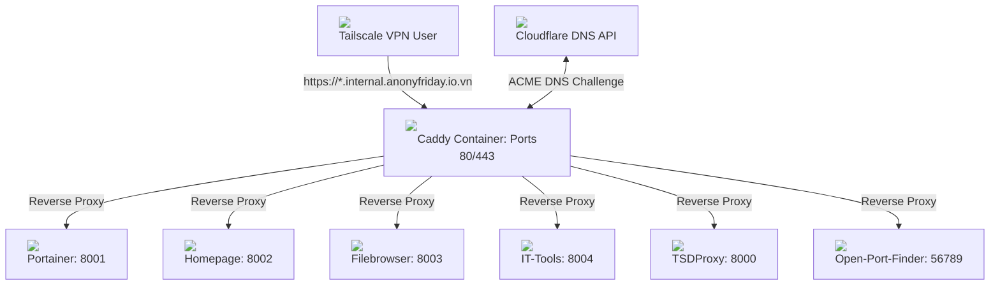
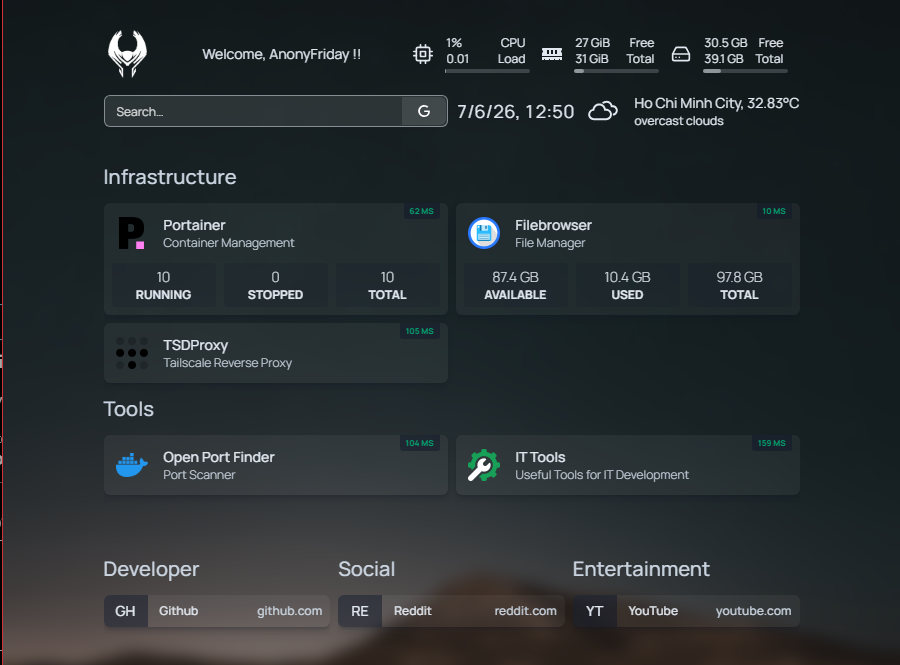
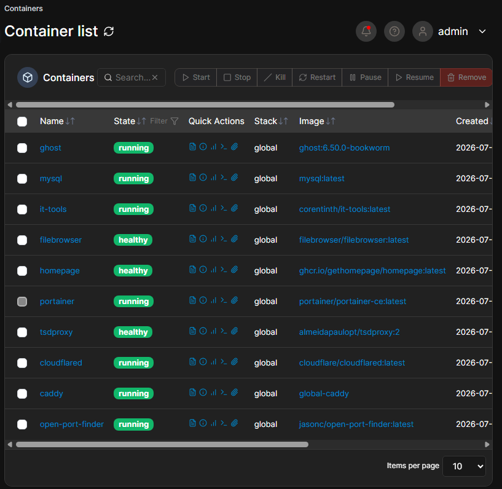
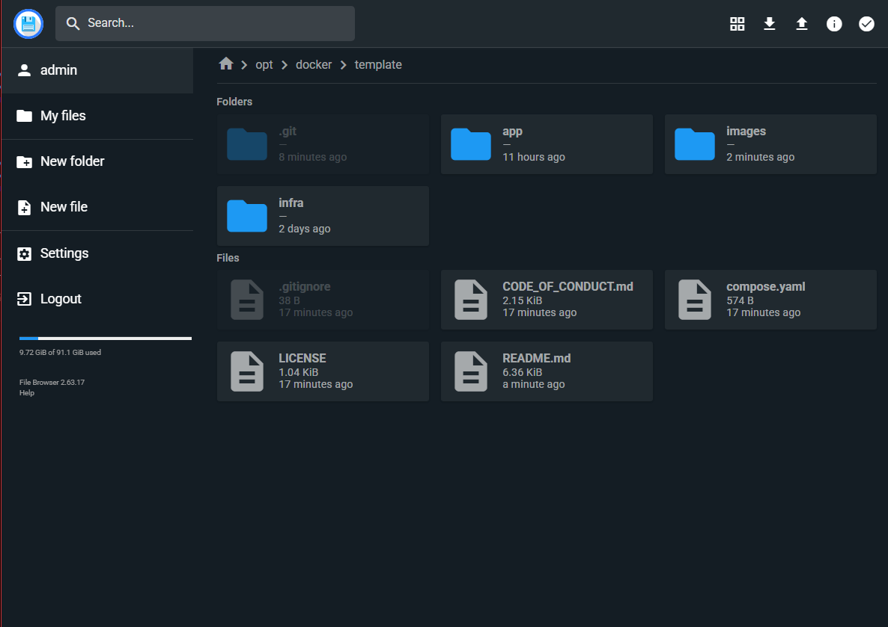
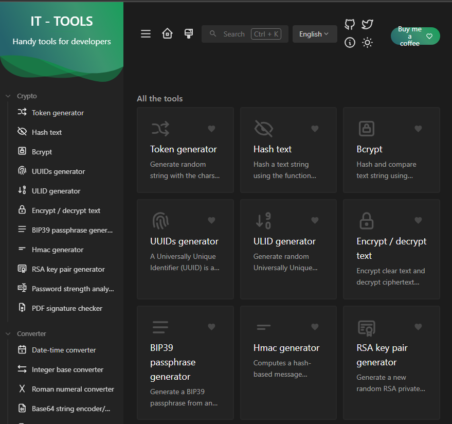
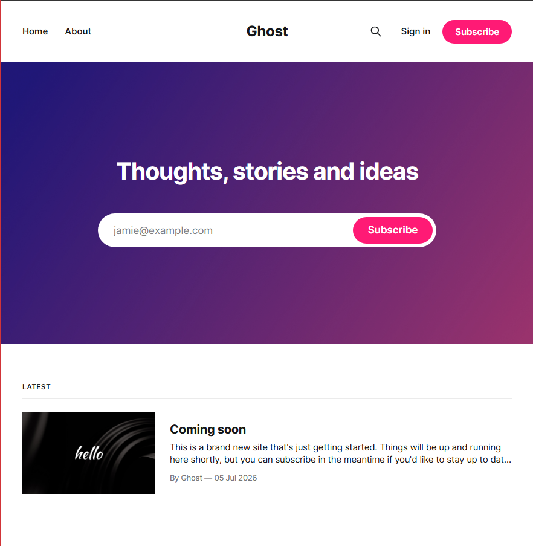
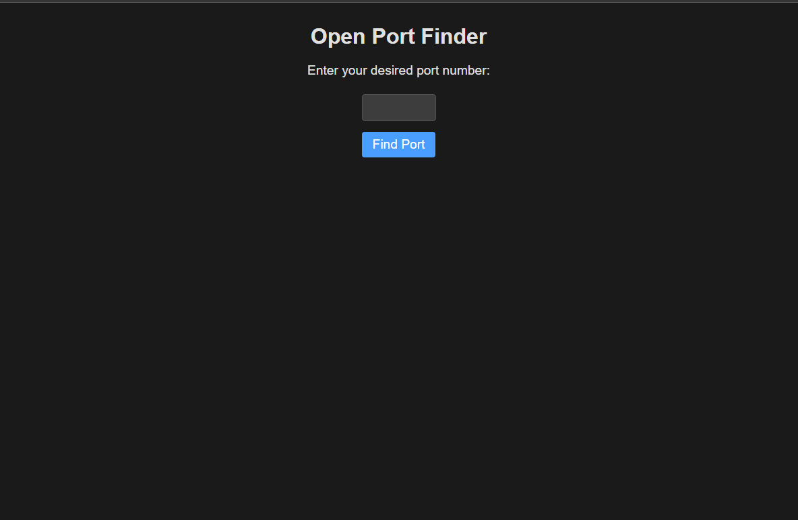
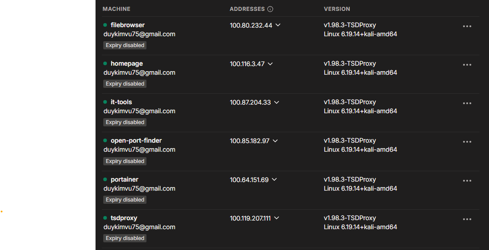

# Infrastructure and Apps Port Registry

## Network Workflows

### Public Access Flow (Cloudflare Tunnel)

```mermaid
graph LR
    User["<img src='https://raw.githubusercontent.com/walkxcode/dashboard-icons/main/png/chrome.png' width='14'/> Public Internet User"] -->|https://blog.anonyfriday.io.vn| CFEdge["<img src='https://raw.githubusercontent.com/walkxcode/dashboard-icons/main/png/cloudflare.png' width='14'/> Cloudflare Edge"]
    CFEdge -->|Secure Tunnel Connection| CFTunnel["<img src='https://raw.githubusercontent.com/walkxcode/dashboard-icons/main/png/cloudflare.png' width='14'/> Cloudflared Container"]
    CFTunnel -->|Direct Forward| Ghost["<img src='https://raw.githubusercontent.com/walkxcode/dashboard-icons/main/png/ghost.png' width='14'/> Ghost Container: Port 9100"]
    Ghost -->|Internal Network| MySQL["<img src='https://raw.githubusercontent.com/walkxcode/dashboard-icons/main/png/mysql.png' width='14'/> MySQL Container: Port 9000"]
```

### Private Access Flow (Tailscale VPN + Caddy)

## Service Screenshots

Here are screenshots of the running services.

<table style="border-collapse: separate; border-spacing: 0 15px;">
  <tr>
    <td width="50%" align="center">
      <b>Homepage</b> 
      
    </td>
    <td width="50%" align="center">
      <b>Portainer</b> 
      
    </td>
  </tr>
  <tr>
    <td width="50%" align="center">
      <b>Filebrowser</b> 
      
    </td>
    <td width="50%" align="center">
      <b>IT-Tools</b> 
      
    </td>
  </tr>
  <tr>
    <td width="50%" align="center">
      <b>Ghost Blog (Public)</b> 
      
    </td>
    <td width="50%" align="center">
      <b>Open-Port-Finder</b> 
      
    </td>
  </tr>
  <tr>
    <td width="50%" align="center">
      <b>Tailscale Network</b> 
      
    </td>
    <td width="50%" align="center">
      <!-- Empty Slot for future service -->
    </td>
  </tr>
</table>

## Infra Services (8000+)

| Port | Service     | Subdomain                                | Note                |
| :--- | :---------- | :--------------------------------------- | :------------------ |
| 8000 | TSDProxy    | `tsdproxy.internal.anonyfriday.io.vn`    |                     |
| 8001 | Portainer   | `portainer.internal.anonyfriday.io.vn`   |                     |
| 8002 | Homepage    | `internal.anonyfriday.io.vn`             | Root domain proxy   |
| 8003 | Filebrowser | `filebrowser.internal.anonyfriday.io.vn` |                     |
| 8004 | IT-Tools    | `it-tools.internal.anonyfriday.io.vn`    |                     |
| 8006 | Grafana     | -                                        | Skip (Empty Config) |
| 8007 | Fail2ban    | -                                        | Skip (Empty Config) |

## App Services (9000+)

| Port | Service      | Subdomain / Database     | Note                   |
| :--- | :----------- | :----------------------- | :--------------------- |
| 9000 | MySQL        | -                        | Active (Used by Ghost) |
| 9001 | PostgreSQL   | -                        | Skip (Empty Config)    |
| 9002 | Redis        | -                        | Skip (Empty Config)    |
| 9003 | SQL Server   | -                        | Skip (Empty Config)    |
| 9100 | Ghost        | `blog.anonyfriday.io.vn` | Active                 |
| 9200 | App Frontend | -                        | Skip (Empty Config)    |
| 9300 | App Gateway  | -                        | Skip (Empty Config)    |

## Exceptions (Host Network Mode)

| Port  | Service          | Description                              |
| :---- | :--------------- | :--------------------------------------- |
| 80    | Caddy HTTP       | External HTTP traffic proxy              |
| 443   | Caddy HTTPS      | External HTTPS traffic proxy with TLS    |
| 56789 | Open-Port-Finder | Scans open host ports                    |
| -     | Cloudflared      | Establishes Cloudflare Tunnel connection |

## DNS Challenge (Private HTTPS)

DNS-01 challenge allows Caddy to obtain trusted SSL/TLS certificates (Let's Encrypt / ZeroSSL) **without public internet exposure**.

1. Caddy requests certificate for `*.internal.anonyfriday.io.vn`.
2. Caddy API automatically creates temporary `_acme-challenge` TXT record in Cloudflare.
3. Certificate Authority checks TXT record to verify domain ownership.
4. Caddy deletes TXT record and loads verified SSL certificate.
5. Tailscale clients access services securely over HTTPS.

## Domain Configuration

### 0. Registrar Setup (Matbao)

Delegate DNS management of `anonyfriday.io.vn` to Cloudflare:

1. Log into **Matbao console**.
2. Change Nameservers (NS) to your **Cloudflare Nameservers** (e.g., `*.ns.cloudflare.com`).
3. Manage all records inside **Cloudflare Dashboard**.

### 1. Public Routing (Cloudflare Tunnel)

Expose public application directly to the internet:

- **Cloudflare Tunnel settings:** Route `blog.anonyfriday.io.vn` → `http://localhost:9100` (Ghost).
- **DNS:** Managed automatically by Cloudflare Tunnel CNAME.

### 2. Private Routing (Tailscale + Caddy)

Route private traffic inside your VPN:

- **A Record:** Point `*.internal` subdomain to your host's Tailscale IP (e.g., `100.x.y.z`).
- **Proxy Status:** **DNS Only (Grey Cloud)**. _Do not proxy (Orange Cloud) internal IPs._

## How to Access Private Infrastructure

To access your internal admin tools (Portainer, Homepage, etc.):

1. **Turn on Tailscale** on your client machine (laptop, phone, etc.).
2. **Log into your Tailnet** (must be the same account hosting the server).
3. Open your browser and navigate directly to your internal domains:
   - Homepage: `https://internal.anonyfriday.io.vn`
   - Portainer: `https://portainer.internal.anonyfriday.io.vn`
   - Filebrowser: `https://filebrowser.internal.anonyfriday.io.vn`
   - IT-Tools: `https://it-tools.internal.anonyfriday.io.vn`
   - TSDProxy: `https://tsdproxy.internal.anonyfriday.io.vn`
